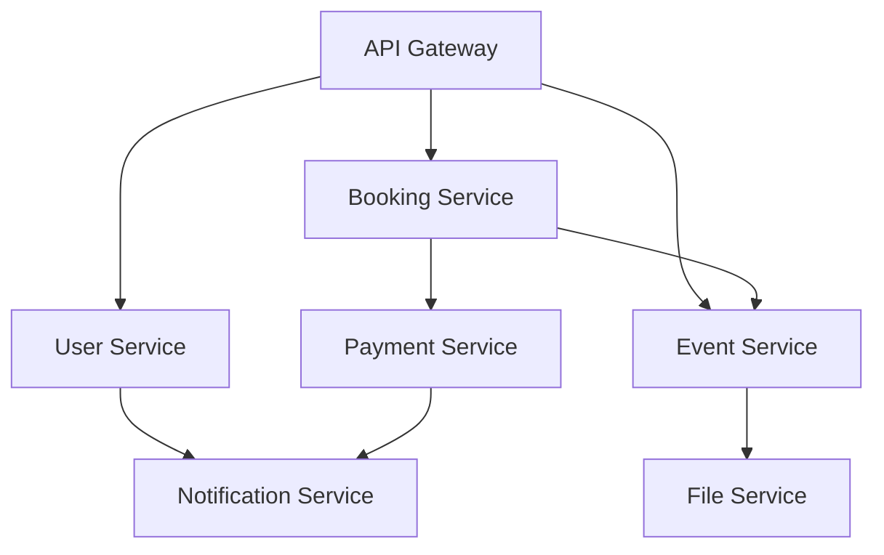

### SeatWise Platform: Actionable Project Management Suite

This document serves as the master guide for the **SeatWise** platform, providing a structured, trackable, and developer-friendly framework to complete the remaining features and scale the system.

---

### 1. Task Tracker (Assignable Tasks)
*Format compatible with Jira, Trello, and GitHub Projects.*

| Task ID | Task Name | Priority | Service | Status | Checkpoints (Definition of Done)                                                       |
| :--- | :--- | :--- | :--- | :--- |:---------------------------------------------------------------------------------------|
| **STW-001** | **Seat Auto-Release Scheduler** | **High** | `event-service` | To Do | `@Scheduled` ~~task runs every 5m; Releases `RESERVED` seats after 15m.~~                  |
| **STW-002** | **Payment Service MVP** | **High** | `payment-service` | To Do | CRUD for Transactions; Webhook for payment status; Integration with `booking-service`. |
| **STW-003** | **Notification Triggers** | **High** | `notification-service` | In Progress | RabbitMQ producers added to Booking & Event services for all status changes.           |
| **STW-004** | **Event Search & Filtering** | **Medium** | `event-service` | To Do | ~~Query DSL or JPA Specifications for searching by title, date, and venue~~                |
| **STW-005** | **SMS Notification Provider** | **Medium** | `notification-service` | To Do | SMS service implementation (e.g., Africa's Talking) added to `NotificationConsumer`.   |
| **STW-006** | **Unit/Integration Tests** | **Medium** | All | To Do | >70% coverage for business logic in `booking-service` and `event-service`.             |
| **STW-007** | **QR Code Generation** | **Low** | `booking-service` | To Do | PDF/Image ticket with QR code generated upon successful payment.                       |

---

### 2. Living Master Document (SRS-to-Code Mapping)
*This section cross-references documentation requirements to specific implementation files.*

| SRS Requirement | Description | Associated Files (Codebase) | Status |
| :--- | :--- | :--- | :--- |
| **FR-01: Auth** | User Reg & Login (JWT) | `user-service`: `UserController`, `UserServiceImpl`, `JwtUtils` | ✅ Done |
| **FR-02: Profile** | User Profile & Pictures | `user-service`: `UserServiceImpl`, `FileServiceClient` | ✅ Done |
| **FR-03: Events** | Event & Venue MGMT | `event-service`: `EventController`, `EventServiceImpl` | ✅ Done |
| **FR-04: Seats** | Real-time Seat Mapping | `event-service`: `Seat`, `EventServiceImpl` | ⚠️ Partial |
| **FR-05: Booking** | Ticket Reservation | `booking-service`: `BookingServiceImpl`, `BookingRepository` | ✅ Done |
| **FR-06: Payment** | M-Pesa/Card Processing | *New Service Required (payment-service)* | ❌ Missing |
| **FR-07: Notif** | Email & SMS Alerts | `notification-service`: `NotificationConsumer`, `EmailConsumer` | ⚠️ Partial |
| **FR-08: Files** | S3-Compatible Storage | `file-service`: `FileStorageServiceImpl`, `MinioConfig` | ✅ Done |

---

### 3. Automated Progress Metrics
*Real-time estimation of module completeness.*

| Service/Module | Completion % | Fully Implemented | Partially Implemented | Not Started |
| :--- | :--- | :--- | :--- | :--- |
| **User Service** | 90% | Auth, Profile, RBAC | Notification Client | - |
| **Event Service** | 75% | Event CRUD, Venue | Seat Expiration, Search | - |
| **Booking Service** | 80% | Booking Logic | Payment Callback | - |
| **Notification** | 60% | History API, Consumer | Email Provider, SMS | - |
| **Payment** | 0% | - | - | Everything |
| **Infrastructure** | 95% | Gateway, Eureka, Common | - | - |

**Recommendation for Tracking**: Maintain a `progress.json` in the root directory that is updated by a CI/CD hook scanning for `@Todo` annotations or test coverage reports.

---

### 4. Step-by-Step Implementation Guides

#### A. Seat Auto-Release Scheduler (`event-service`)
1.  **Repository**: Add `List<Seat> findByStatusAndReservedAtBefore(ESeat status, Instant time)` to `SeatRepository`.
2.  **Service**: In `EventServiceImpl`, create a method `cleanupExpiredReservations()` that calls the repository and sets status to `AVAILABLE`.
3.  **Scheduler**: Add a `@Component` class with a `@Scheduled(fixedRate = 300000)` (5 mins) task calling the service.
4.  **Transaction**: Ensure the method is `@Transactional` to avoid partial updates.

#### B. Payment Service (New Service)
1.  **Bootstrap**: Create a new Spring Boot app with `eureka-client`, `web`, `jpa`, and `rabbitmq`.
2.  **API Design**:
    - `POST /api/v1/payments/initiate`: Create a `PENDING` transaction.
    - `POST /api/v1/payments/webhook`: Handle external provider callbacks (M-Pesa/Stripe).
3.  **Flow**:
    - `initiate` -> Returns payment URL/ID.
    - `webhook` -> If Success, send `PAYMENT_SUCCESS` event to RabbitMQ `payment-exchange`.
4.  **Integration**: `booking-service` listens to `payment-exchange` and updates `BookingStatus` to `BOOKED`.

---

### 5. Cross-Service Dependency & Flows

#### System Dependency Graph

#### Ticket Booking Sequence Flow
1.  **User** -> `event-service`: Select Seat (Status: `RESERVED`).
2.  **User** -> `booking-service`: Create Booking (Status: `PENDING`).
3.  **Booking Service** -> `payment-service`: Initiate Payment.
4.  **Payment Service** -> **External Gateway**: Process Transaction.
5.  **External Gateway** -> `payment-service`: (Callback) Payment Success.
6.  **Payment Service** -> **RabbitMQ**: Publish `PaymentConfirmedEvent`.
7.  **Booking Service** -> **DB**: Update Booking to `BOOKED`.
8.  **Event Service** -> **DB**: Update Seat to `SOLD`.
9.  **Notification Service** -> **User**: Send Email/SMS Confirmation.

---

### Clarifications & Assumptions
- **Assumed Scope**: Frontend (Mobile/Web) is assumed to be a separate project and not part of this backend roadmap.
- **Notification Provider**: Implementation assumes a mock SMTP server (like Mailtrap) or a real provider (SendGrid) is available.
- **Concurrency**: High-traffic handling (Redis for seat locking) is recommended for Phase 3 if horizontal scaling is required.